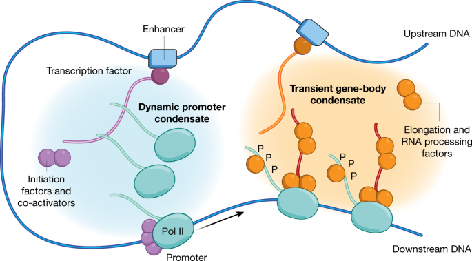
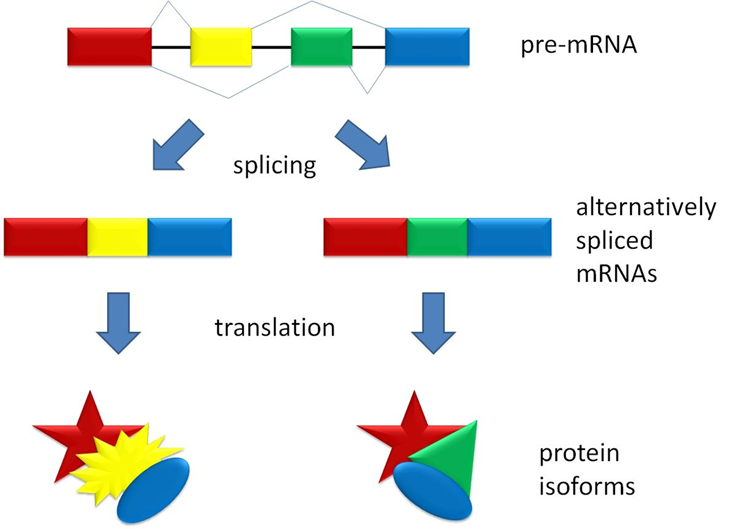
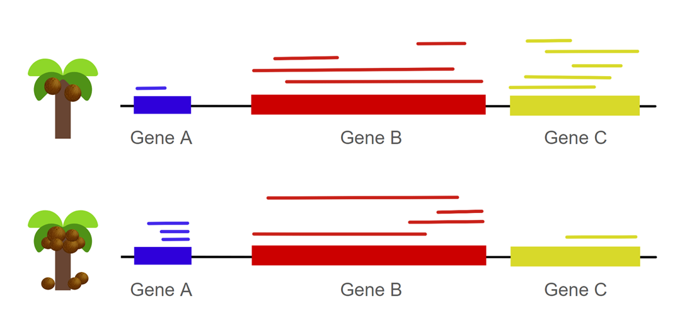
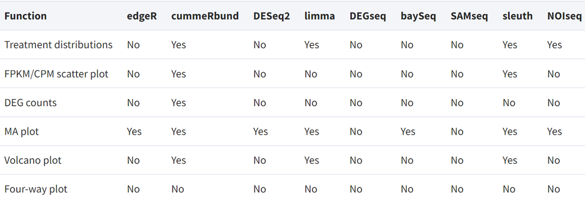

# Detection of Differentially Expressed Genes #  
#### Group 18 Jenelle Truong, Jiachen Xi, Zhuoling Huang  
*BENG183 2023FALL*  

## 1. Introduction to Differentially Expressed Genes
While biological organisms of the same species may share a substantial portion of their genetic material, the manifestation of this shared genome can exhibit notable differences in terms of gene expression levels among individuals. For instance, one human being’s DNA blueprints can be 99.9% identical to another, but their expression of shared genes are not necessarily identical. 

According to the central dogma of molecular biology, genes within DNA are transcribed into RNA, which can then form polypeptides or functional protein products through translation. 
Gene transcription and translation processes encompass intricate networks of molecular signals, transcription factors, and epigenetic modifications that collectively influence how genes are activated or suppressed. 

Therefore, gene differential expression study is important to determine the underlying biological mechanisms that lead to certain phenotypes. 

## 2. Differentially expressed genes at the biological level
* __Transctiption:__  regulatory elements interact with DNA and affect overall gene expression.  For instance, certain non-coding RNAs, such as large intergenic non-coding RNAs (lincRNAs), have been found to direct chromatin-modifying complexes to specific genomic loci, thus affecting epigenetic state. Incorporation of nucleotide sequences, like promoters and enhancers, works respectively to initiate transcription and increase transcription rate.
  
   
* __Translation:__ alternative splicing transforms pre-mRNA into various isoforms of mRNA and protein products following translation.The figure below shows the coding exons as colored blocks and non-coding introns as black sections in the pre-mRNA. The different exon block combinations then highlights the results of alternative splicing through the skipping of certain exons and selection of different splice sites.   

## 3. DEG Analysis Workflow  
1. Sample Collection and RNA Extraction:
   - Biological samples, such as tissues or cells, are collected from different conditions.  
   - RNA is extracted from these samples, capturing the genetic information in the form of messenger RNA (mRNA).  
2. RNA Sequencing:
   - Sequencing technologies such as NGS are applied to the collected samples and generate RNA sequencing data.
   - RNA-seq provides a comprehensive snapshot of the transcriptome by revealing the abundance of different RNA molecules, raw ssequencing data obtained.
3. Data Preprocessing:
   - Raw sequencing data undergoes preprocessing steps, including quality control, read alignment to a reference genome, and quantification of gene expression levels.
4. Genome Alignment:
   - Map the cleaned reads to a reference genome using alignment tools such as HISAT2, STAR, or Bowtie.
   - By aligning the RNA-seq reads to the genomic coordinates, we're able to identify where the transcripts originate.
5. Normalization:
   - To account for variations in sequencing depth and other technical biases, the expression values are normalized. 
   - The figure below shows what mapped gene reads may look like for a hypothetical example of two coconut trees, one low-yielding and the other high-yielding.
   
> At first glance, it appears that there is an increased count of gene A, roughly the same counts of gene B, and decreased counts of gene C when we compare the high-yielding to the low-yielding coconut tree. However, normalization of these counts is necessary, because metrics should positively correlate with number of reads and negatively correlate with library size and gene length. Thus, transcripts per million (TPM) is an ideal metric for normalization that also allows for comparison across samples.
6. Statistical Analysis:  
   - Statistical methods, such as edgeR, DESeq2, or limma, are commonly used to identify genes that are differentially expressed between conditions. 
   - These methods take into account the variability within samples and provide statistical measures.
   - Different methods have different functions implemented as the table below shows. Selecting an appropriate methodology is crucial depending on the specific objectives of the study.  

7. Fold Change and p-value:  
   - Genes are often characterized by fold change, representing the magnitude of expression change, and p-value, indicating the statistical significance of the change.  
   - A threshold is set for both fold change and p-value to select genes that are significantly differentially expressed.  
8. Biological Interpretation:  
   - Once DEGs are identified, they can be further analyzed to understand their biological significance. We will discuss interpretation in more detail later.
 

## 4. Result Interpretation  
It is important to interpret the results from differential gene expression analysis, because the results may confer information about potential disease biomarkers. The discovery of new biomarkers then can be applied in the clinical setting for disease screening purposes and the measurement of disease progression. 
> It does not indicate causation. 
