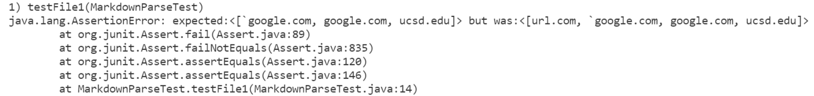
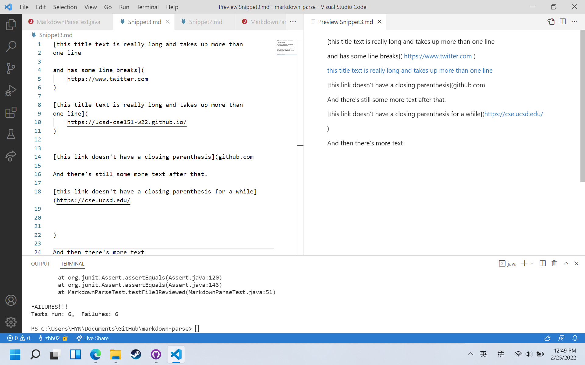

# Week 8 Lab Report 4 <br/>
## Repository links
### [My Markdown-parse repository](https://github.com/zhh02/markdown-parse.git)
### [Markdown-parse repository reviewed](https://github.com/jdweak/markdown-parse.git)<br/>
## Snippet 1
### What it should produce according to the CommonMark demo site: <br/>
<br/>
Therefore the link to be returned from this snippet should be ```[`google.com, google.com, ucsd.edu]```
### Make it a test in MarkdownParseTest.java
<br/>
### Run JUnit test with my MarkdownParse
<br/>
The JUnit test fails because my implementation fails to exclude ```url.com```. <br/>
### Run JUnit test with the reviewed MarkdownParse
<br/>
The JUnit test fails because it fails to exclude ```url.com``` and to return ```ucsd.edu```.<br/>
### Answering Questions
I am not particularly sure about my implementation since our group is using a very different approach from professor's original approach. However, the test result seems like backticks are allowed and can be returned successfully by our implementation while the error is that it fails to determine the location of the backticks, therefore returning ```url.com``` as well. In order to fix this, a small code change that determines the index of backticks and brackets can be added so that the link with backticks' index smaller than that of the first open bracket can be removed from the links to be removed. <br/><br/>

## Snippet 2
### What it should produce according to the CommonMark demo site: <br/>
<br/>
Therefore the link to be returned from this snippet should be ```[a.com, a.com(()), example.com]```
### Make it a test in MarkdownParseTest.java
<br/>
### Run JUnit test with my MarkdownParse
<br/>
The JUnit test fails because my implementation returns ```b.com``` instead of ```a.com``` for the first nested link.
### Run JUnit test with the reviewed MarkdownParse
<br/>
The JUnit test fails because it fails return any of the links.
### Answering Questions
A more complicated code change might be needed in order to fix the problem for snippet 2. The first nested link is returned incorrectly because the code fails to identify the nested link inside brackets. The code change need to find new brackets even if one is already encountered, and it is supposed to only return the link when it encounters the first close braket.<br/><br/>

## Snippet 3
### What it should produce according to the VSCode preview page: <br/>
<br/>
**_I actually got a question here but I didn't get a chance to ask during tutor/office hour: it seems like the CommonMark demo site (demo site only shows ```https://ucsd-cse15l-w22.github.io/```) and VSCode preview are producing different results for snippet 3, is it the webpage layout issue or something else?_**<br/>
### Make it a test in MarkdownParseTest.java
<br/>
### Run JUnit test with my MarkdownParse
<br/>
The JUnit test fails because it fails return any of the links.
### Run JUnit test with the reviewed MarkdownParse
<br/>
The JUnit test fails because it fails return any of the links.
### Answering Questions
The issue for this snippet is that the new lines are stopping the code from reading the links, while the links are formmated correctly. A small code change that removes all new lines using ```"\n"``` might help fixing this wrong output.
