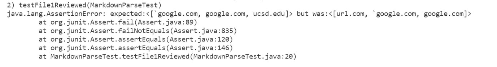
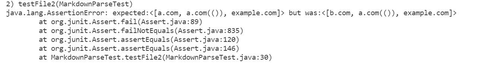
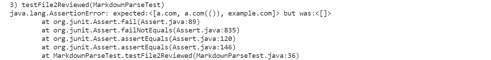

# Week 8 Lab Report 4 <br/>
## Repository links
### [My Markdown-parse repository](https://github.com/zhh02/markdown-parse.git)<br/>
### [Markdown-parse repository reviewed](https://github.com/jdweak/markdown-parse.git)<br/><br/>
## Snippet 1
> ### What it should produce according to the CommonMark demo site: <br/>
<br/>
Therefore the link to be returned from this snippet should be ```[`google.com, google.com, ucsd.edu]```
> ### Make it a test in MarkdownParseTest.java
<br/>
> ### Run JUnit test with my MarkdownParse
<br/>
The JUnit test fails because my implementation fails to exclude ```url.com```. <br/>
> ### Run JUnit test with the reviewed MarkdownParse
<br/>
The JUnit test fails because it fails to exclude ```url.com``` and to return ```ucsd.edu```.<br/>
> ### Answering Questions
+ I am not particularly sure about my implementation since our group is using a very different approach from professor's original approach. However, the test result seems like backticks are allowed and can be returned successfully by our implementation while the error is that it fails to determine the location of the backticks, therefore returning ```url.com``` as well. In order to fix this, a small code change might not be enough since we need to determint the index of brackets and differentiate the backticks in front of the open brackets to not return ```url.com```<br/><br/>

## Snippet 2
> ### What it should produce according to the CommonMark demo site: <br/>
<br/>
Therefore the link to be returned from this snippet should be ```[a.com, a.com(()), example.com]```
> ### Make it a test in MarkdownParseTest.java
<br/>
> ### Run JUnit test with my MarkdownParse
<br/>
The JUnit test fails because my implementation fails to include any of the links.
> ### Run JUnit test with the reviewed MarkdownParse
<br/>
The JUnit test fails because it fails to exclude ```url.com``` and to return ```ucsd.edu```.<br/>
