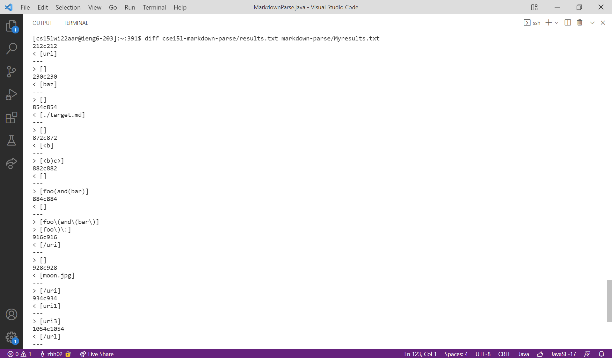
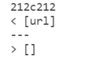
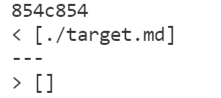

# Week 10 Lab Report 5 <br/>
### [Link to MarkdownParse.java of our group](https://github.com/atruong39/markdown-parse/blob/main/MarkdownParse.java)

### Find tests with different results
I used the diff command from Week 9 lab task to find the test cases with different results: first use ```bash script.sh > results.txt``` command to put the output to a txt file instead of printing out in the terminal for each repository, and then use ```diff cse15l-markdown-parse/results.txt markdown-parse/Myresults.txt``` command to compare the two txt files. 

<br/>
<br/>

### Test 1: [194.md](https://github.com/ucsd-cse15l-w22/markdown-parse/blob/main/test-files/194.md) <br/>
<br/>
+ According to the results, Joe's implementation of markdown-parse prints ```url``` while our groups' implementation prints ```[]```. Joe's implementation is correct for this test.<br/>
+ Implementation of our group fails to recognize and return the link with nested square brackets since we are only checking the presence of the brackets at line 15 instead of the numbers or indexes of the brackets (or parentheses). To fix this, the code need to handle only the "outermost" brackets and parentheses.

### Test 2: [483.md](https://github.com/ucsd-cse15l-w22/markdown-parse/blob/main/test-files/483.md) <br/>
<br/>
+ According to the results, Joe's implemnetation of markdown-parse prints ```./target.md``` while our group's implementation prints ```[]```. Our group's implementation is correct for this test. <br/>
+ Joe's implementation returns the link without checking the content enclosed by square brackets. The link is valid only when at least one non-space character is enclosed by the brackets. Joe's implementation might need to check not only the brackets and parentheses but also the content between them. 
